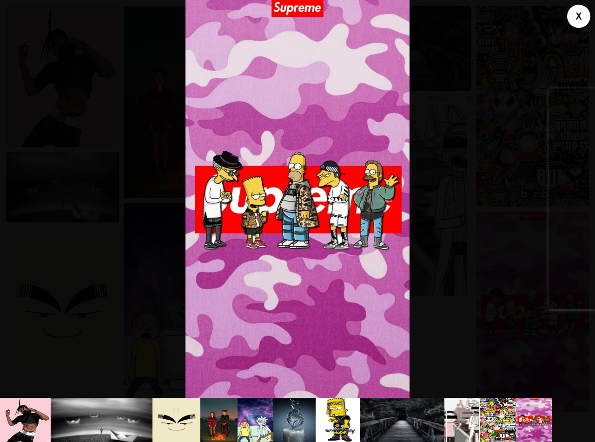
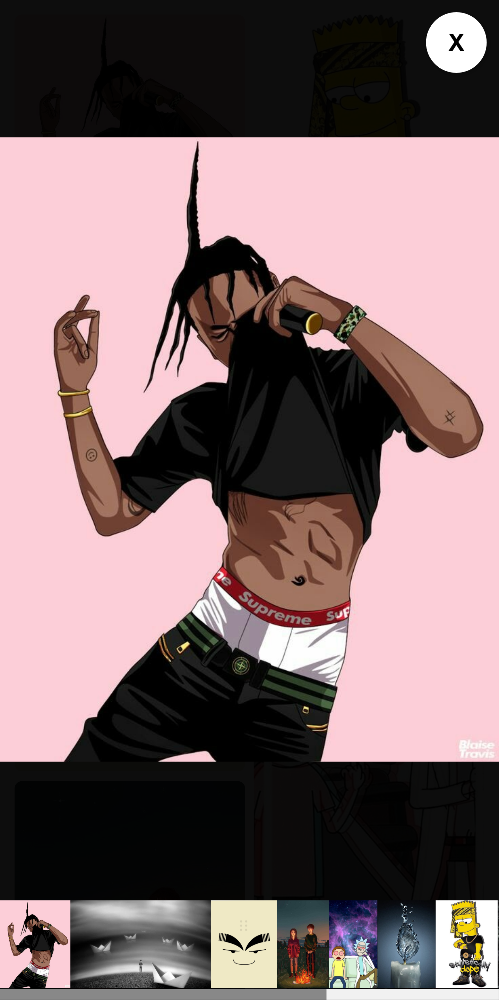

![Built With Stencil](https://img.shields.io/badge/-Built%20With%20Stencil-16161d.svg?logo=data%3Aimage%2Fsvg%2Bxml%3Bbase64%2CPD94bWwgdmVyc2lvbj0iMS4wIiBlbmNvZGluZz0idXRmLTgiPz4KPCEtLSBHZW5lcmF0b3I6IEFkb2JlIElsbHVzdHJhdG9yIDE5LjIuMSwgU1ZHIEV4cG9ydCBQbHVnLUluIC4gU1ZHIFZlcnNpb246IDYuMDAgQnVpbGQgMCkgIC0tPgo8c3ZnIHZlcnNpb249IjEuMSIgaWQ9IkxheWVyXzEiIHhtbG5zPSJodHRwOi8vd3d3LnczLm9yZy8yMDAwL3N2ZyIgeG1sbnM6eGxpbms9Imh0dHA6Ly93d3cudzMub3JnLzE5OTkveGxpbmsiIHg9IjBweCIgeT0iMHB4IgoJIHZpZXdCb3g9IjAgMCA1MTIgNTEyIiBzdHlsZT0iZW5hYmxlLWJhY2tncm91bmQ6bmV3IDAgMCA1MTIgNTEyOyIgeG1sOnNwYWNlPSJwcmVzZXJ2ZSI%2BCjxzdHlsZSB0eXBlPSJ0ZXh0L2NzcyI%2BCgkuc3Qwe2ZpbGw6I0ZGRkZGRjt9Cjwvc3R5bGU%2BCjxwYXRoIGNsYXNzPSJzdDAiIGQ9Ik00MjQuNywzNzMuOWMwLDM3LjYtNTUuMSw2OC42LTkyLjcsNjguNkgxODAuNGMtMzcuOSwwLTkyLjctMzAuNy05Mi43LTY4LjZ2LTMuNmgzMzYuOVYzNzMuOXoiLz4KPHBhdGggY2xhc3M9InN0MCIgZD0iTTQyNC43LDI5Mi4xSDE4MC40Yy0zNy42LDAtOTIuNy0zMS05Mi43LTY4LjZ2LTMuNkgzMzJjMzcuNiwwLDkyLjcsMzEsOTIuNyw2OC42VjI5Mi4xeiIvPgo8cGF0aCBjbGFzcz0ic3QwIiBkPSJNNDI0LjcsMTQxLjdIODcuN3YtMy42YzAtMzcuNiw1NC44LTY4LjYsOTIuNy02OC42SDMzMmMzNy45LDAsOTIuNywzMC43LDkyLjcsNjguNlYxNDEuN3oiLz4KPC9zdmc%2BCg%3D%3D&colorA=16161d&style=flat-square)

# Image-Gallery

> npm i @themindleproject/img-gallery

**You can now use img-gallery-image with img-gallery to add lazy loading. Will be added by default soon.**

This is a web component to help users integrate a masonry style image gallery in their websites and PWAs.




## Using this component

### Script tag

- Put this script tag `<script src='https://unpkg.com/@themindleproject/img-gallery@latest/dist/img-gallery.js'></script>` in the head of your index.html
- Then you can use the element anywhere in your template, JSX, html etc

### Node Modules

- Run `npm i @themindleproject/img-gallery --save`
- Put a script tag similar to this `<script src='node_modules/@themindleproject/img-gallery/dist/img-gallery.js'></script>` in the head of your index.html
- Then you can use the element anywhere in your template, JSX, html etc

### In a stencil-starter app

- Run `npm i @themindleproject/img-gallery --save`
- Add an import to the npm packages `import @themindleproject/img-gallery;`
- Then you can use the element anywhere in your template, JSX, html etc

#### Usage Example

**Please do not use both methods shown below. i.e dont combine the two. If combined the component will default to the 2nd method**

1.  Place your images as direct children of the component

- It is important that the images are direct children. Do not place them in a container such as a `div` or `section` etc.

```html

    
    
    
    
    
</img-gallery>
```

2.  Feed an array of image source urls to the src property

- Please note that this is for use within frameworks such as Angular, Ionic Framework, Stencil, React etc.

In your ts file.

```typescript
URLArray: Array<string> = ['example1.jpg','example2.jpg','example2.jpg','example2.jpg'];
```

Then In your html file.

```html
</img-gallery>
```

Or In your tsx file

```tsx
URLArray: Array<string> = ['example1.jpg','example2.jpg','example2.jpg','example2.jpg'];

render() {
    return(
        <div>
            </img-gallery>
        </div>
    )
};
```

#### Component Properties

Image Gallery Component only takes two optional properties.

1.  `src` property discussed above;
2.  `color` property.

- This is the background color of the Gallery. If not supplied the Gallery will inherit the background color of the page,div or section that it is placed in. It can either be a valid css color name or a valid css hex color code.

```html

    ...
</img-gallery>

<!-- or -->


    ...
</img-gallery>
```

### img-gallery-image

- We have introduced a new component `img-gallery-image`.
- Use it together with `img-gallery` to add lazy-loading.
- You can also use it as standalone.

#### Usage example

1.  With `img-gallery`

```html

    </img-gallery-image>
    </img-gallery-image>
    </img-gallery-image>
    </img-gallery-image>
</img-gallery>
```

2.  Standalone

```html
</img-gallery-image>
```

> We will support lazy loading by default in our next version.

#### Extras

- Click or Tap on an image to View
- In View Mode Click or Tap on the far right to view next, far left to view previous. No distracting arrows.

#### Coming Soon

- [ ] slideshow
- [ ] zoom images
- [x] lazy-loading images

I won't be doing images with captions. But if I change my mind I will do it in a different component.
